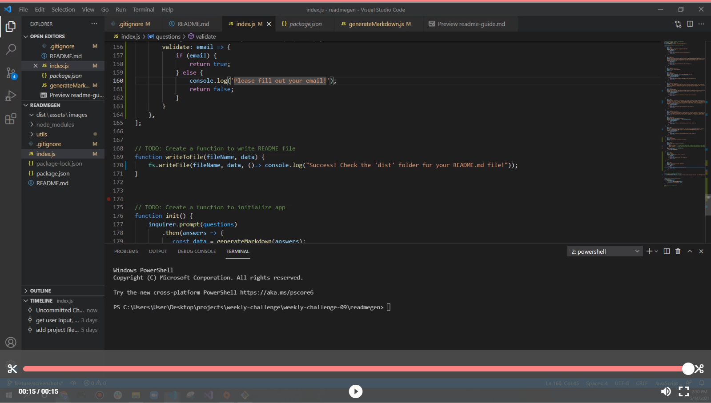
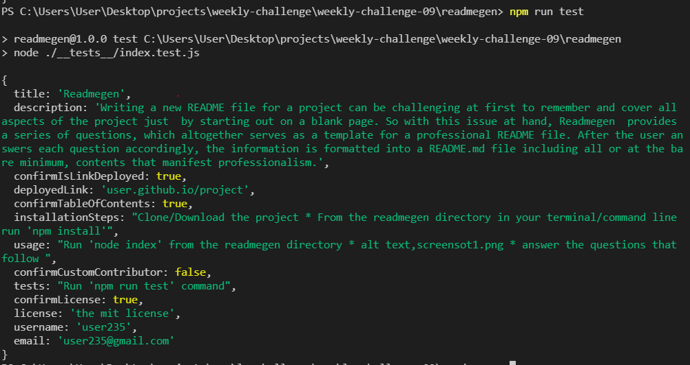

# Readmegen

## Description 

  Writing a new README file for a project can be challenging at first to remember and cover all aspects of the project just by starting out on a blank page. So with this issue at hand, Readmegen provides a series of questions, which altogether serves as a template for a professional README file. After the user answers each question accordingly, the information is formatted into a README.md file including all or at the bare minimum, contents that manifest professionalism.  

  
  
  
## Table of Contents
  
  
  * [Installation](#installation)
  * [Usage](#usage)
  * [License](#license)
  * [Contributing](#contributing)
  * [Tests](#tests)
  * [Questions](#questions)
  

## Installation

  - Clone/Download the project
  - From the readmegen directory in your terminal/command line run 'npm install'
  
## Usage 
  
  - For clarity, use the links below to watch a quick tutorial on how to use Readmegen:
    - Video 1: https://drive.google.com/file/d/1GR7o2reZ4brt7auRIEK2fHxW2D_11-QD/view
    - Video 2: https://drive.google.com/file/d/1sZXR8KOMqZltuYLCxNfK-bYPiGfwNO_D/view
  

  
## License
  
  Licensed under [THE MIT LICENSE](https://choosealicense.com/licenses/mit/)

## Contributing
  Please read the [Contributor Covenant](https://www.contributor-covenant.org/version/2/0/code_of_conduct/)

## Tests
  - Run 'npm run test' command in the readmegen directory in your command line/terminal
  

## Questions
  - 👋 Hi, I’m dkbaffour777
  - GitHub profile link: [github.com/dkbaffour777/](https://github.com/dkbaffour777/)
  - 📫 How to reach, email: dkbaffour777@gmail.com
